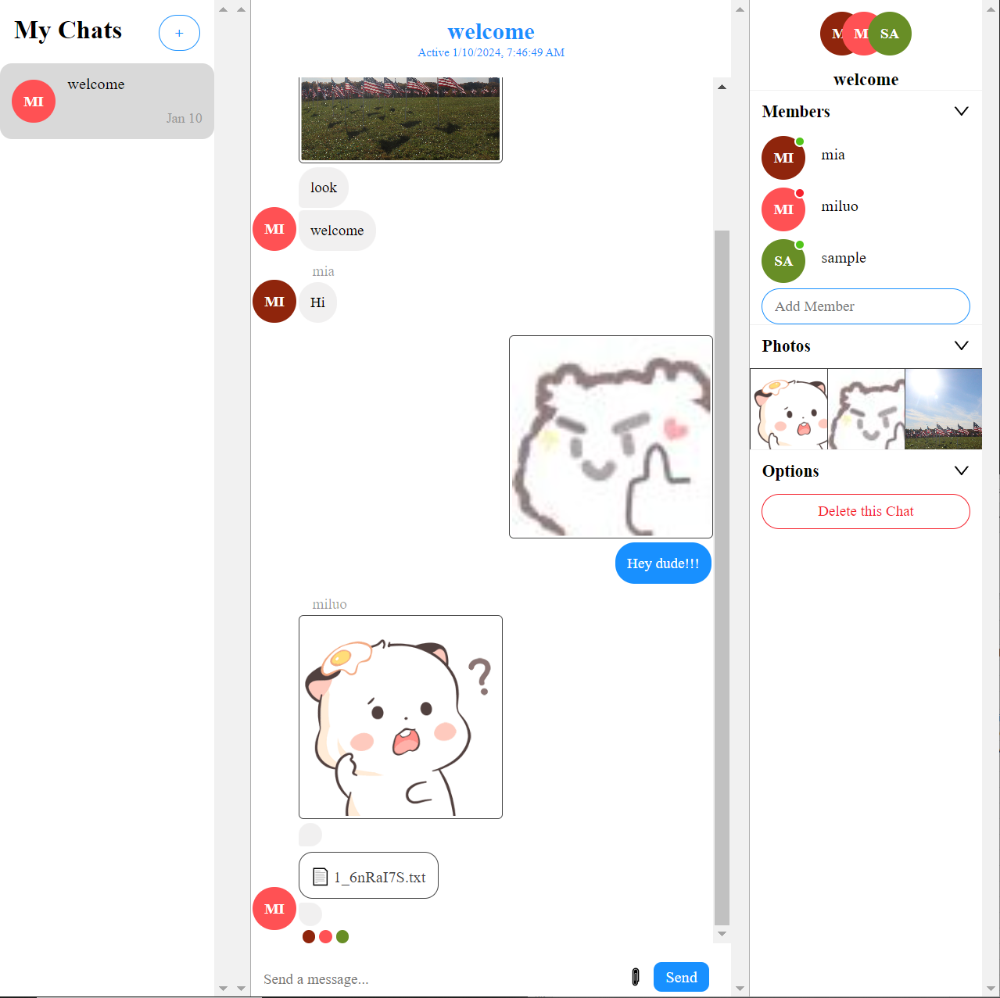

A realtime chat app with NodeJS, ReactJS, and ChatEngine.io

## Running the Node.js Server Locally

Make sure you have an up-to-date version of Node.js installed on your system. If you don't have Node.js installed, you can install it from [here](https://nodejs.org/en).

1. Clone this repository

   `git clone https://github.com/luomi16/chatapp.git`

2. `cd chatapp/backend`

3. Install the server dependencies

   `npm install`

4. Start the server

   `npm run start`

5. Open a browser and access: http://localhost:3001

## Running React Locally

1. `cd ../frontend`

2. Install the server dependencies

   `npm install`

3. Start the server

   `npm run dev`

## The key dependencies I use
- `express` is the HTTP server framework that used to create the HTTP server and handle incoming requests.

- `cors` allows us to process requests from other hosts (for our ReactJS app). Enables Cross-Origin Resource Sharing (CORS) so that requests from different origins (like a frontend running on a different server) can be processed by this server.

- `axios` allows us to send HTTP requests to other servers (for Chat Engine APIs)

- `nodemon` allows us to run the server in dev-mode

## Backend: 
1. set up a basic Node.js server using Express
2. handle requests with CORS
3. communicate with an external API using Axios
4. authenticate a user by sending their username to the Chat Engine API

